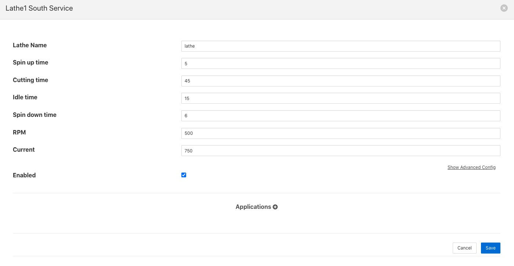

.. Images

Lathe Simulation
================

The *fledge-south-lathesim* plugin is a south plugin that simulates a lathe with a number of attached sensors. The purpose of this plugin is for test and demonstration only as it does not attach to any real device.

The plugin simulates four sensor devices attached to the virtual lathe

  - The PLC controlling the lathe that gives details such as cutting depth, tool position, motor speed

  - A current sensor that measures the current draw from the lathe

  - A vibration sensor giving the RMS value of the vibration and the dominant vibration frequency

  - A thermal imaging device that takes temperature readings every second from the motor, gearbox, headstock, tailstock and tool on the lathe

The vibration sensor reports at half the rate of the other sensors attached to the lathe in order to simulate handling data that is related to the same physical device but not available at the same rate as the other sensors.

The simulation runs a repeated pattern of operations;

  - A spin-up period where the lathe spins up to speed from idle.

  - A period where the lathe is doing some cutting of a work piece.

  - A spin-down period where the lathe is slowing to a stop.

  - An idle period where the work piece is removed and replace with a new billet.

During the spin up period the lathe speed, expressed is revolutions per minute, will linearly increase from 0 to the maximum defined.

When the lathe is cutting the speed will remain predominantly constant, with a small random variation, whilst the depth of cut and X position of the cutting tool will change.

The lathe then spins down to rest and will remain idle for a short time whilst the worked item is removed and a new billet of material is installed.

During the cutting period the current draw and vibration will alter as load is applied to the piece.

Configuring the PLC
-------------------

The are a number of configuration options that can be applied to the simulation.

+---------+
| |lathe| |
+---------+

  - **Lathe Name**: The name of the lathe in this configuration. This name is used to derive the assets returned from the three sets of sensors. The PLC data is returned with an asset name that machines the lathe name. The current data has *Current* appended to the lathe name and the asset id of the vibration name is the lathe name with *Vibration* appended to it. The temperature data uses the asset with the name of the lathe and *IR* appended to it.

  - **Spin up time**: The time in seconds it takes the lathe to spin up to working speed from idle.

  - **Cutting time**: The time in seconds for which the lathe is cutting material.

  - **Spin Down time**: The time in seconds for which the lathe is spining down from operating speed to stop.

  - **Idle time**: The time in seconds for which the lathe is idle between jobs.

  - **RPM**: The operating speed of the lathe, expressed in revolutions per minute.

  - **Current**: The nominal operating current draw of the lathe.
